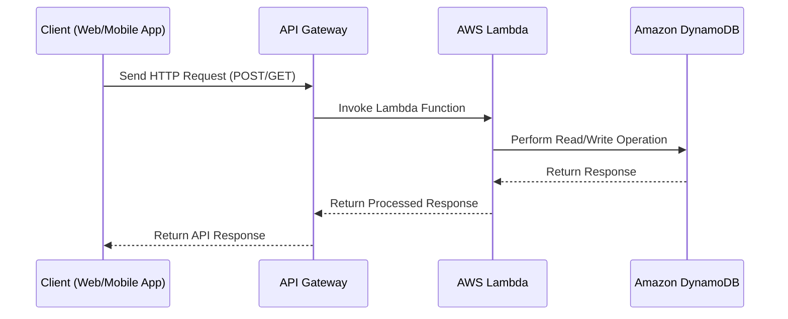
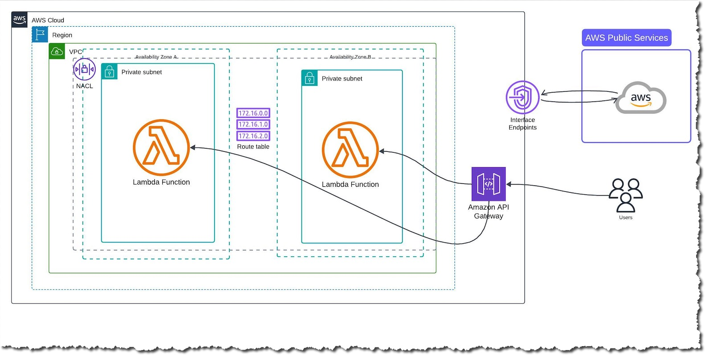
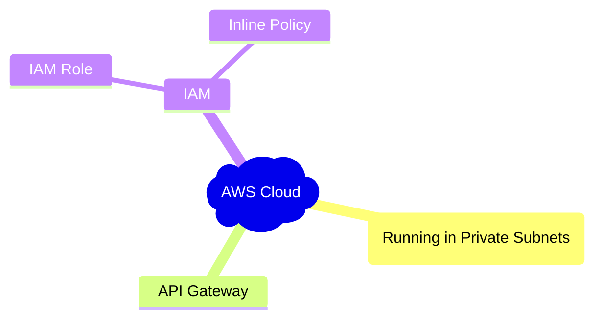

&nbsp;&nbsp;&nbsp;&nbsp;&nbsp;&nbsp;&nbsp;&nbsp;&nbsp;


---

## Table of Contents

- [About the Project](#about-the-project)
- [Architecture](#architecture)
- [Prerequisites](#prerequisites)
- [Installation & Setup](#installation--setup)
- [Contributing](#contributing)
  - [Code of Conduct](#code-of-conduct)
- [License](#license)
- [Contact](#contact)

---

## AWS Workshop - Serverless Patterns : Lab 01  [](https://catalog.workshops.aws/serverless-patterns/en-US)


This project demonstrates the creation of an AWS Private Only VPC using AWS CloudFormation. The VPC is designed to host resources that do not require direct internet access, ensuring a secure and isolated environment. Key features include:

- **Private Subnets**: Resources are deployed in private subnets, enhancing security by restricting direct internet access.
- **VPC Endpoints**: Enables private connectivity to AWS services such as S3, KMS, and Secrets Manager without using an internet gateway.
- **Security Groups and NACLs**: Implements fine-grained control over inbound and outbound traffic to resources within the VPC.
- **High Availability**: Resources are distributed across multiple Availability Zones to ensure fault tolerance and high availability.

This setup is ideal for workloads that require enhanced security and compliance, such as backend services, databases, and internal applications.

## 🏗 Architecture

Below is the architecture of the application:


#### Infrastructure



### AWS Services Used
- **Amazon VPC**
- **Amazon Lambda**:
- **Amazon DynamoDB**
- **Amazon API Gateway**

---

## 🛠 Prerequisites

Before setting up the project, ensure you have:
- An AWS account

Make sure you have the following installed:
- AWS CLI
- AWS CloudFormation console access
- An AWS account with appropriate permissions
- Clone the repo
    ```sh
   git clone https://github.com/subhamay-bhattacharyya/0301-serverless-py-cft.git
   ```
- Upload the nested stack templates to a bucket in your AWS account
    ```
    cd <your local directory>aws-cfn-nested-stacks
    aws s3 sync /cfn-templates/ s3://<your bucket> --sse "aws:kms" \
          --sse-kms-key-id <your kms key id> --storage-class GLACIER_IR
    ```

---

## 🚀 Installation & Setup

Follow these steps to set up the project locally:

# Clone the repository
git clone https://github.com/subhamay-bhattacharyya/0301-serverless-py-cft.git

# Navigate to the project folder
cd 0301-serverless-py-cft

# Deploy AWS resources using AWS CloudFormation console or CLI
1. Validate the CloudFormation template: Before deploying, validate the CloudFormation template to ensure there are no errors.

```
aws cloudformation validate-template --template-body file://template.yaml
```
2. Deploy the CloudFormation stack: Use the AWS CLI to deploy the stack.

```
aws cloudformation deploy --template-file template.yaml --stack-name private-vpc-root-stack --capabilities CAPABILITY_NAMED_IAM
```

3. Monitor the deployment: You can monitor the progress of the stack deployment in the AWS CloudFormation console.

4. Verify resources: Once the stack is deployed, verify that all resources have been created successfully by checking the AWS Management Console.

## Add User Lambda test Events

##### Put Item
```json
{
  "operation": "putItem",
  "name": "Subhamay",
  "address": "23 Rosebud Dr, Trumbull, CT-06611",
  "email": "subhamoyb@yahoo.com",
  "phone": "203 482 3898"
}
```

##### Batch Write Item
```json
{
  "operation": "batchWriteItem",
  "userCount": "93"
}
```

##### Get Item
```json
{
  "operation": "getItem",
  "id": "bca756e9-74e0-43a3-bcb4-115f57239e12"
}
```

##### Update Item
```json
{
  "operation": "updateItem",
  "id": "72d6bcf2-73b2-40e7-8c1e-af1c48f760fc",
  "name": "Subhamay"
}
```

##### Query Items
```json
{
  "operation": "queryItems",
  "id": "72d6bcf2-73b2-40e7-8c1e-af1c48f760fc"
}
```

##### Delete Item
```json
{
  "operation": "deleteItem",
  "id": "c350b1ad-83c5-48c0-9b7d-88d4f3c7f937"
}
```

##### Scan Item
```json
{
  "operation": "scanItems",
  "id": "64d02fc1-4dec-4674-8189-ca21e3f9bb58"
}
```

##### Item Count
```json
{
  "operation": "itemCount"
}
```


---

## Contributing

Contributions are what make the open-source community such an amazing place to learn, inspire, and create. Any contributions you make are **greatly appreciated**.

If you have a suggestion that would make this project better, please fork the repo and create a pull request. You can also simply open an issue with the tag "enhancement".
Don't forget to give the project a star! Thanks again!

1. Fork the Project
2. Create your Feature Branch (`git checkout -b feature/AmazingFeature`)
3. Commit your Changes (`git commit -m 'Add some AmazingFeature'`)
4. Push to the Branch (`git push origin feature/AmazingFeature`)
5. Open a Pull Request

##### Code of Conduct

Please note that this project is released with a [Contributor Code of Conduct](CODE_OF_CONDUCT.md). By participating in this project you agree to abide by its terms.

## License

Distributed under the MIT License. See `LICENSE` for more information.

## Contact

Subhamay Bhattacharyya
[ LinkedIn](https://www.linkedin.com/in/subhamay-bhattacharyya/)
[ GitHub](https://github.com/subhamay-bhattacharyya)
[](mailto:subhamay.aws@gmail.com)
Project Link: [https://github.com/subhamay-bhattacharyya/0301-serverless-py-cft](https://github.com/subhamay-bhattacharyya/0301-serverless-py-cft)